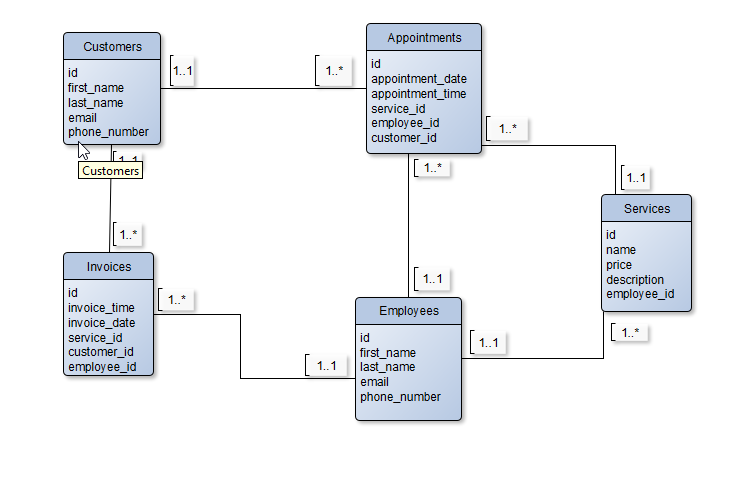

Aplikacija MONA makeup predstavlja aplikaciju salona za šminkanje, ideja za ovu temu dolazi od želje da realiziram ovakvu aplikaciju zbog posla kojim se bavim uz studiranje, a koja bi mi olakšala organizaciju termina, zaposlenika i usluga. 
Baza se sastoji od 5 tablica : zaposlenici, klijenti, radnici, usluge i termini.

Korištene su sve potrebne tehnologije: Docker, JQuery, Flask, Kafka i Redis.
Omogućeno je dodavanje novih zaposlenika, i njihov prikaz u real-time-u kao i brisanje i uređivanje, tako da svi korisnici mogu vidjeti sve trenutne promjene bez osvježavanja stranice.

